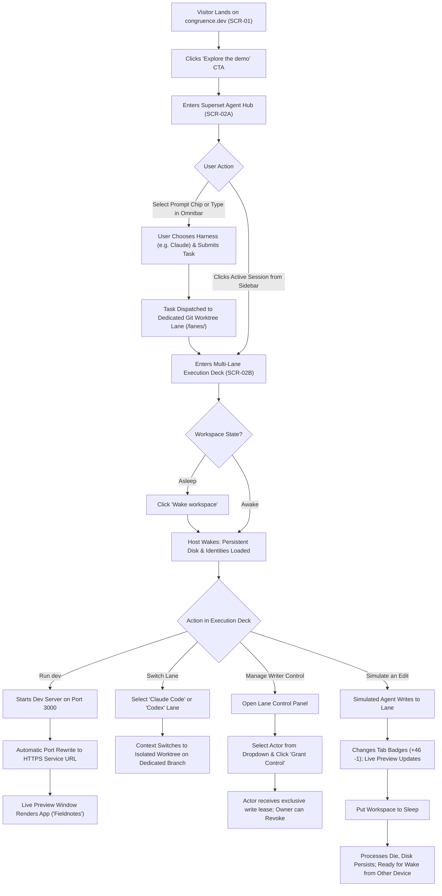

# Congruence · App Flow & Interaction Architecture

> **Purpose:** Document every screen, user journey, state transition, and interaction specification for Congruence (`congruence.dev`).  
> **Status:** Approved  
> **UX Designer:** ux-designer  
> **Visual Reference:** Superset (`superset.sh`) Precision Agent Workspace  
> **Date:** 2026-10-07  

---

## 1. Entry Points & Screen Inventory

| Screen ID | Route / Anchor | Screen Name | Key Purpose | Primary Actions |
| :--- | :--- | :--- | :--- | :--- |
| **SCR-01** | `/` | **Landing & Concept Surface** | Articulate value proposition, show architecture, and host the interactive preview | Click "Explore the demo", read workflow & details, toggle FAQ accordions |
| **SCR-02A** | `/workspace#hub` | **Superset Agent Hub & Omnibar** | Central dispatch center featuring the `{< >}` glyph, starter prompt chips, and floating multi-harness omnibar | Type task prompt, switch harness (`Claude` / `Codex`), adjust effort/model, launch task |
| **SCR-02B** | `/workspace#deck` | **Multi-Lane Execution Deck (Split View)** | Active execution canvas combining multi-worktree lanes, terminal PTY, private HTTPS preview, and lane leases | Switch lanes, toggle Preview/Terminal/Changes, Run dev server, Grant/Revoke writer leases, Sleep/Wake host |
| **SCR-03** | `/workspace#modal-info` | **Product Details Modal** | Technical architecture breakdown (Control plane, Sprite host, Vault, Security) | Read technical specs, close modal |
| **SCR-04** | Responsive `/workspace` | **Mobile Execution View** | Focused, high-efficiency mobile experience for inspecting previews, observing terminals, and granting leases | Switch between Preview and Terminal tabs, Tap Grant/Revoke, Wake host |

---

## 2. Primary User Journey: End-to-End Workflow

---

## 3. Detailed Screen Specifications

### 3.1 SCR-01: Landing & Concept Surface (`/`)
* **Header Bar (Obsidian Theme):**
  - Left: Congruence logo mark (triple horizontal bars) + `congruence.dev`.
  - Right Navigation Links: `How it works` (`#how-it-works`), `The details` (`#the-details`), `Explore the demo` (`#demo` button).
* **Hero Section:**
  - Sub-tag: `A PARABOX PRODUCT · CONCEPT PREVIEW` in mono uppercase.
  - Headline: `Your repository, your agents, and the running app. In one place.`
  - Body: `A shared browser workspace for the coding agents you already use. Keep the files, terminal, and live preview together, then pick up from another device.`
  - CTA Button: `Explore the demo` (crisp white on obsidian).
  - Micro-copy: `Your tools. Your accounts. A browser is enough.`
* **Embedded Workspace Section:**
  - Section Header: `A LOOK INSIDE / The work stays together.`
  - Meta tags: `Interactive · simulated workspace` | `Open full preview` action.
  - Hosts the complete interactive component `SCR-02A` & `SCR-02B`.
* **Section 01 / THE IDEA:**
  - Title: `Changing devices shouldn't mean rebuilding your context.`
  - Narrative on execution context surviving machine transitions.
* **Section 02 / THE WORKFLOW:**
  - 4 numbered steps:
    1. *Bring your repository:* Connect GitHub project to a persistent host.
    2. *Use your own agents:* Run real Claude Code or Codex CLI with existing subscriptions.
    3. *See what's running:* Dev server opens private HTTPS preview alongside terminal.
    4. *Come back to the work:* Return from another device, wake workspace, restart services.
* **Section 03 / BUILT AROUND SHARED WORK:**
  - 3 Core Columns:
    - *Continuity:* Files and configured identities survive sleep. Live processes are ephemeral.
    - *Parallel Work:* One worktree per writer (`pair lane`, `claude/progress`, `codex/copy`).
    - *Explicit Control:* "Watch first. Grant when needed." Read-only observation with revocable write leases.
* **Section 04 / THE DETAILS (Accordion FAQ):**
  - 4 technical questions answered faithfully from `congruence.dev.md`.
* **Section 05 / Final CTA & Footer:**
  - Headline: `A browser. Your tools. A place to pick up where you left off.`
  - Footer: `congruence.dev · A Parabox product · Product concept · October 2026`.

---

### 3.2 SCR-02A: Superset Agent Hub & Floating Omnibar (`/workspace#hub`)
Inspired directly by `superset.sh`:
* **Left Navigation Sidebar (`#0E0E12`):**
  - Window controls: macOS triple dots (`#FF5F57`, `#FEBC2E`, `#28C840`).
  - Action button: `+ New Workspace`.
  - Nav items: `Search (Cmd+K)`, `Workspaces`, `Automations`, `Tasks`, `Pull requests`, `Pages`.
  - Collapsible `SESSIONS` / `DESKTOP` tree:
    - `⠋ fix onboarding crash` (`+46 -1`)
    - `● billing webhooks` (`+193`)
    - `○ refactor auth flow` (`+394 -23`)
    - `● speed up cold start` (`+33`)
  - Bottom profile: `HT Hector's Team` with settings gear icon.
* **Center Hub:**
  - Centered monospace bracket glyph: `{< >}`
  - Heading: `What should we build next?`
  - Starter prompt suggestion chips:
    - 💡 *Set up this project for Congruence*
    - 💡 *Explain to me how this repository works*
    - 💡 *Find and fix a small bug*
* **The Floating Omnibar (`#16161B` with top inset highlight):**
  - Input field: *"Upgrade a dependency and fix what breaks..."*
  - Bottom action row:
    - `+` (Attach context)
    - Harness selector: `Claude v` (with orange Anthropic sunburst icon), `Codex v`, `OpenCode v`
    - Model selector: `Default model v`
    - Effort selector: `Default effort v`
    - Submit button: `↑` pill button. Clicking submits or switches view into the Execution Deck (`SCR-02B`).
* **Bottom Status Bar:**
  - `This device / Fly Sprite` · `ss` workspace · `Worktree ⇕ main`

---

### 3.3 SCR-02B: Multi-Lane Execution Deck (Split View)
When inspecting or running an active worktree session:
* **Top Header Bar:**
  - Breadcrumbs: `PARABOX / WORKSPACES / Sample app` with a padlock `Private` badge.
  - Status Pill: `● Workspace awake` (emerald dot) or `○ Workspace asleep` (muted gray dot).
  - Power Action: Button toggling between `Sleep workspace` and `Wake workspace`.
  - Product Info Trigger: `The product ⓘ` button opening the technical architecture modal.
  - View switcher: `Hub view` vs `Execution view`.
* **Left Sub-Sidebar (Width: ~220px):**
  - PROJECT: `parabox / sample-app` (tagged `Fictional repository`).
  - WORK LANES:
    - `P Pair lane` · branch: `main` (active badge).
    - `C Claude Code` · branch: `claude/progress`.
    - `O Codex` · branch: `codex/copy`.
    - Caption: *"One worktree per writer. One shared place to work."*
  - WORKSPACE CONTEXT:
    - `Files & Git`: **Persistent**
    - `Tool identities`: **Retained**
    - `Running processes`: **Ephemeral**
* **Center Canvas (Flex-1):**
  - Lane sub-header: Active Lane Name, branch pill, status (`Ready`).
  - View Tabs: `Preview`, `Terminal 1`, `Changes 0` (or dynamic diff count).
  - Action Toolbar: `Try the workspace`, `Run dev` button, `Simulate an edit` button.
  - **In Preview Mode:**
    - Dark URL bar: Padlock + `sample-app.congruence.example` + `Saved preview` or `Live service` badge.
    - Embedded App Frame: Displays **Fieldnotes** sample app (minimalist dark/light note list with interactive checkmarks).
    - Preview Footer: `Port 3000 · HTTPS · private`.
  - **In Terminal Mode:**
    - Dark xterm.js PTY terminal showing interactive shell session:
      - Prompt: `admin@congruence:~/sample-app$`
      - Output: Claude Code / Codex execution logs, port detection message (`Listening on port 3000 -> https://sample-app.congruence.example`).
  - **In Changes Mode:**
    - Split git diff viewer displaying modified files with syntax coloring.
* **Right Sidebar (Width: ~240px):**
  - IN THIS WORKSPACE: `You` (Owner · full access), `Claude Code`, `Codex`.
  - LANE CONTROL:
    - Current writer dropdown: `You`, `Claude Code`, `Codex`.
    - Helper status text: *"You can write in pair lane. Agents can watch until you grant control."*
    - Button: `Grant control` (or `Revoke control`).
    - Checkbox: `[x] Allow other actors to watch. Watching is read-only. Control is explicit, scoped to this lane, and revocable.`
  - RECENT ACTIVITY: Timestamped event log.

---

## 4. Alternate & Edge State Specifications

### 4.1 Hub to Execution Transition
1. User types in the Omnibar or clicks a starter chip (e.g. *Find and fix a small bug*).
2. Omnibar displays animated execution pulse.
3. System creates a new worktree lane `agent/fix-bug` in the sidebar with a `⠋` spinner.
4. Screen smoothly transitions to `SCR-02B` (Execution Deck) focused on the new worktree lane.

### 4.2 Workspace Sleep & Wake Transition Flow
1. User clicks `Sleep workspace`.
2. Workspace status switches to `○ Putting workspace to sleep...`.
3. Running dev server process is killed; terminal displays: `[Process terminated - Host entering sleep]`.
4. Preview switches to static snapshot state: `Saved preview (Host asleep)`.
5. Status changes to `○ Workspace asleep`.
6. User clicks `Wake workspace`:
   - Host wakes (< 15s simulation).
   - Files and tool credentials verify as preserved.
   - User clicks `Run dev` to restart ephemeral services.

---

## 5. Navigation & Keyboard Shortcuts

* `Cmd/Ctrl + K` -> Open Search / Command Palette.
* `Cmd/Ctrl + P` -> Quick switch between lanes (`Pair lane`, `Claude Code`, `Codex`).
* `Cmd/Ctrl + 1` -> Switch to Preview tab.
* `Cmd/Ctrl + 2` -> Switch to Terminal tab.
* `Cmd/Ctrl + 3` -> Switch to Changes tab.
* `Esc` -> Close modal or toggle hub/deck view.
