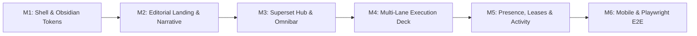

# Congruence · Implementation & Build Plan

> **Purpose:** Ordered 6-milestone build sequence with dependencies, inputs, outputs, definition of done, and explicit test checkpoints for Congruence (`congruence.dev`).  
> **Status:** Approved  
> **Systems Architect:** architect  
> **Visual Reference:** Superset (`superset.sh`) Precision Agent Workspace  
> **Date:** 2026-10-07  

---

## 1. Build Milestones Overview

---

## 2. Milestone Breakdown

### Milestone 1: App Shell, Layout & Obsidian Design Tokens
* **Objective:** Establish the precision dark obsidian design tokens, Inter/Geist typography scale, IBM Plex Mono code styling, global header, and layout wrappers matching Superset (`superset.sh`).
* **Tasks:**
  1. Configure `globals.css` with `:root` CSS variables from `design.md` (Obsidian canvas `#0A0A0C`, sidebar `#0E0E12`, card `#121216`, hairlines `#222227`, Claude amber `#E8804A`, Emerald `#10B981`).
  2. Implement `Header` component with triple horizontal bars logo mark, `congruence.dev` text, navigation anchors (`How it works`, `The details`), and `Explore the demo` CTA pill.
  3. Create base container and footer with product concept notice and copyright.
* **Inputs:** `design.md`, `flow.md` (SCR-01)
* **Outputs:** `src/app/layout.tsx`, `src/app/globals.css`, `src/components/Header.tsx`, `src/components/Footer.tsx`
* **Definition of Done:** App renders deep obsidian `#0A0A0C` background with crisp white typography and hairline borders. No broken styles.
* **Checkpoint M1:**
  - [ ] App compiles without TypeScript or lint warnings (`npm run build`).
  - [ ] Header renders navigation links and "Explore the demo" CTA.
  - [ ] `:root` CSS variables are applied and inspectable.

---

### Milestone 2: Editorial Landing Surface & Architecture Narrative
* **Objective:** Implement the narrative sections articulating the value proposition, workflow, pillars, and technical FAQs.
* **Tasks:**
  1. Implement Hero Section: Monospace subtag `A PARABOX PRODUCT · CONCEPT PREVIEW`, headline *"Your repository, your agents, and the running app. In one place."*, and lead copy.
  2. Implement Section 01 / THE IDEA: *"Changing devices shouldn't mean rebuilding your context."*
  3. Implement Section 02 / THE WORKFLOW: 4-step sequence (Bring repo, Use agents, See running app, Come back).
  4. Implement Section 03 / BUILT AROUND SHARED WORK: 3 pillars (Continuity, Parallel work, Explicit control).
  5. Implement Section 04 / THE DETAILS: Interactive accordion FAQ answering the 4 core architecture questions.
  6. Implement Section 05 / Final CTA banner.
* **Inputs:** `prd.md`, `flow.md` (SCR-01), `design.md`
* **Outputs:** `src/app/page.tsx`, `src/components/LandingHero.tsx`, `src/components/WorkflowSection.tsx`, `src/components/PillarsSection.tsx`, `src/components/FaqAccordion.tsx`
* **Definition of Done:** All copy from `congruence.dev.md` is rendered faithfully with responsive layout and working accordion toggles.
* **Checkpoint M2:**
  - [ ] All 5 sections render in order with correct typography and spacing.
  - [ ] Clicking FAQ items expands and collapses answers smoothly.
  - [ ] Clicking navigation anchors scrolls to corresponding sections.

---

### Milestone 3: Superset Agent Hub, Left Navigation & Floating Omnibar
* **Objective:** Implement the Superset-inspired dispatch hub (`SCR-02A`) featuring the left navigation sidebar with worktree sessions, the `{< >}` hero glyph, starter chips, and the floating multi-harness omnibar.
* **Tasks:**
  1. Implement Left Navigation Sidebar (`#0E0E12`):
     - Window controls (macOS triple dots).
     - `+ New Workspace` button.
     - Nav items: `Search (Cmd+K)`, `Workspaces`, `Automations`, `Tasks`, `Pull requests`, `Pages`.
     - Collapsible `SESSIONS` list with animated spinners (`⠋`), branch names, and diff counters (`+46 -1`).
     - Bottom profile: `HT Hector's Team` with settings gear.
  2. Implement Center Hub:
     - Monospace bracket glyph `{< >}`.
     - Headline: *"What should we build next?"*.
     - Starter prompt chips (💡 *Set up this project for Congruence*, 💡 *Explain to me how this repository works*, 💡 *Find and fix a small bug*).
  3. Implement Floating Omnibar:
     - Text input with placeholder *"Upgrade a dependency and fix what breaks..."*.
     - Multi-harness dropdown: `Claude` (with Anthropic icon), `Codex`, `OpenCode`.
     - Model selector: `Default model v` (e.g. `claude-3-7-sonnet`, `o3-mini`).
     - Effort selector: `Default effort v` (`Low`, `Medium`, `High`).
     - Submit button `↑` transitioning into Execution Deck (`SCR-02B`).
  4. Implement Bottom Status Bar:
     - Host indicator (`Fly Sprite`), workspace, and worktree (`main`).
* **Inputs:** `flow.md` (SCR-02A), `design.md`, `schema.md`
* **Outputs:** `src/components/workspace/SupersetSidebar.tsx`, `src/components/workspace/PromptHub.tsx`, `src/components/workspace/FloatingOmnibar.tsx`, `src/components/workspace/StatusBar.tsx`
* **Definition of Done:** Users can type into the omnibar, toggle harnesses, click starter prompts, and trigger execution transitions.
* **Checkpoint M3:**
  - [ ] Left sidebar renders all navigation links and worktree sessions with diff stats.
  - [ ] Omnibar allows switching between Claude, Codex, and OpenCode with accurate styling.
  - [ ] Clicking a prompt chip or pressing enter on the Omnibar smoothly transitions to the Execution Deck.

---

### Milestone 4: Multi-Lane Execution Deck, Live HTTPS Preview & Terminal PTY
* **Objective:** Build the active execution deck (`SCR-02B`) with worktree lanes, dev server action bar, embedded **Fieldnotes** HTTPS preview frame, and simulated xterm.js PTY terminal.
* **Tasks:**
  1. Implement Top Header Bar with breadcrumb `PARABOX / WORKSPACES / Sample app (Private)`, status pill (`● Workspace awake` / `○ Workspace asleep`), and `Sleep workspace` / `Wake workspace` button.
  2. Implement Left Sub-Sidebar with Work Lanes (`Pair lane [main]`, `Claude Code [claude/progress]`, `Codex [codex/copy]`) and Workspace Context persistence indicators.
  3. Implement Center Tab Deck: `Preview`, `Terminal 1`, and `Changes 0` (or dynamic diff count).
  4. Implement Action Bar: `Run dev` button and `Simulate an edit` button.
  5. Implement Preview Tab:
     - Dark URL chrome: Padlock + `sample-app.congruence.example` + `Saved preview` or `Live service` badge.
     - Embedded **Fieldnotes** sample app: clean minimalist dark note/task app with interactive checkboxes.
     - Preview footer: `Port 3000 · HTTPS · private`.
  6. Implement Terminal Tab:
     - Interactive shell session showing Claude Code / Codex execution output, CLI prompts, and port detection rewrite (`Listening on port 3000 -> https://sample-app.congruence.example`).
  7. Implement Changes Tab:
     - Git diff view showing modifications in the active lane's worktree.
  8. Wire `Run dev` to start the simulated service and `Simulate an edit` to update Fieldnotes and git diff.
* **Inputs:** `flow.md` (SCR-02B), `design.md`, `trd.md`
* **Outputs:** `src/components/workspace/ExecutionDeck.tsx`, `src/components/workspace/PreviewPane.tsx`, `src/components/workspace/TerminalPane.tsx`, `src/components/workspace/ChangesPane.tsx`, `src/components/workspace/FieldnotesApp.tsx`
* **Definition of Done:** Clicking "Run dev" transitions preview to Live Service; clicking "Simulate an edit" updates preview content and increments Changes count.
* **Checkpoint M4:**
  - [ ] Tab switching between Preview, Terminal, and Changes works seamlessly.
  - [ ] "Run dev" switches port status to Live HTTPS service.
  - [ ] "Simulate an edit" updates Fieldnotes tasks and populates git diff in Changes tab.

---

### Milestone 5: Presence, Lane Control (Grant/Revoke) & Recent Activity
* **Objective:** Implement the right sidebar with workspace actor list, scoped lane write lease controls ("Watch first, grant when needed"), and real-time activity log.
* **Tasks:**
  1. Implement "In This Workspace" actor list: `You` (Owner · full access), `Claude Code`, `Codex` with styled identity monograms and status badges.
  2. Implement Lane Control panel:
     - Current writer dropdown (`You`, `Claude Code`, `Codex`).
     - Dynamic status helper text.
     - `Grant control` / `Revoke control` action button.
     - Checkbox: `[x] Allow other actors to watch`.
  3. Implement Recent Activity feed recording timestamped events (workspace opened, identities loaded, dev server run, write lease granted).
  4. Implement Product Info Modal (`The product ⓘ`) with 3-plane architecture summary.
* **Inputs:** `flow.md` (SCR-02B & SCR-03), `schema.md`, `design.md`
* **Outputs:** `src/components/workspace/ActorSidebar.tsx`, `src/components/workspace/LaneControlPanel.tsx`, `src/components/workspace/ActivityFeed.tsx`, `src/components/workspace/ProductInfoModal.tsx`
* **Definition of Done:** Granting control to Claude Code updates the writer lease, alters terminal prompt styling, and logs the event in activity feed.
* **Checkpoint M5:**
  - [ ] Changing Current writer and clicking "Grant control" updates the active write lease.
  - [ ] Owner can click "Revoke control" to reclaim exclusive write permissions.
  - [ ] Activity feed logs all interactions with accurate human-readable timestamps.
  - [ ] Product Info Modal opens, renders technical summary, and closes via ESC/click outside.

---

### Milestone 6: Responsive Mobile Layout & Playwright End-to-End Verification
* **Objective:** Polish mobile viewport responsiveness and write exhaustive Playwright tests covering all user journeys.
* **Tasks:**
  1. Optimize layout for mobile viewports: collapsible drawers for sidebars, full-width canvas tabs, touch-friendly buttons.
  2. Implement Playwright test suite `tests/congruence.spec.ts` covering:
     - Landing page render and FAQ accordion interaction.
     - Omnibar typing, harness toggle, and prompt submission.
     - Workspace sleep and wake transitions.
     - Lane switching between Pair lane, Claude Code, and Codex.
     - "Run dev" dev server startup and Live Service preview URL update.
     - "Simulate an edit" updating Changes tab and preview notes.
     - Lane Control grant and revoke lease flow.
     - Product Info modal open/close.
  3. Execute automated test suite and verify 100% pass rate.
* **Inputs:** `flow.md`, `prd.md`, `trd.md`
* **Outputs:** `tests/congruence.spec.ts`, responsive styling refinements
* **Definition of Done:** All Playwright end-to-end tests pass across desktop and mobile viewports with zero flaky failures.
* **Checkpoint M6:**
  - [ ] `npx playwright test` runs and passes 100% of test scenarios.
  - [ ] No layout shifts or horizontal scrollbars on mobile viewports (375px width).
  - [ ] The full workflow matches the 20-second film test defined in `prd.md`.
