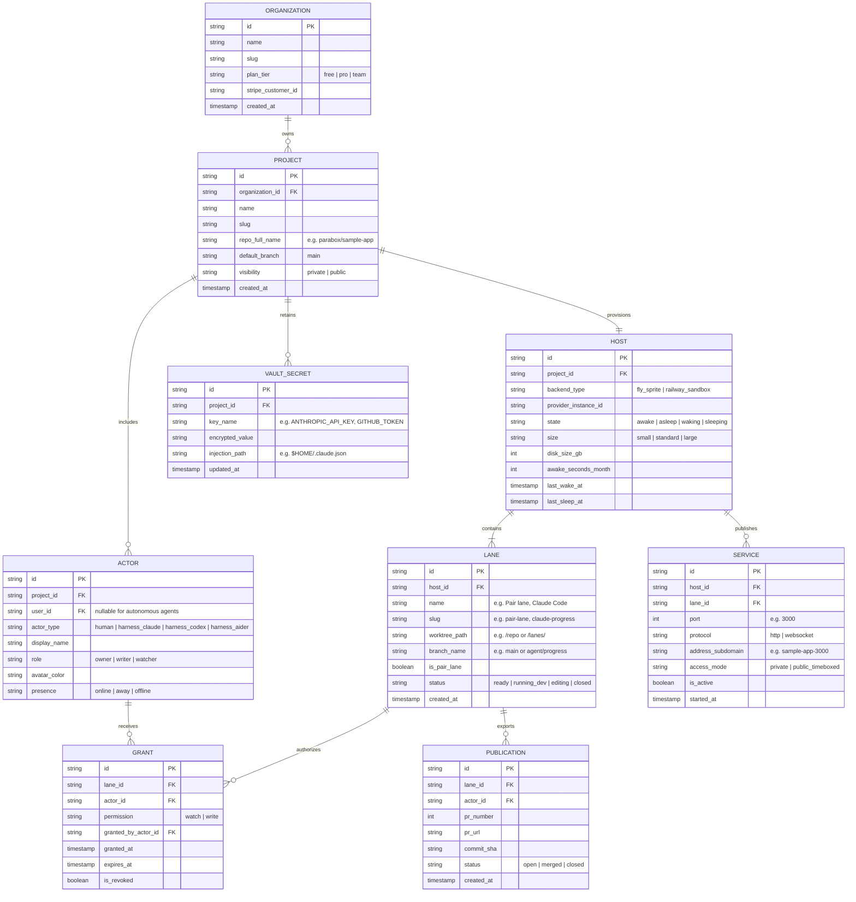

# Congruence · Domain Data Schema

> **Purpose:** Document entities, relationships, data types, and authorization models for Congruence (`congruence.dev`).  
> **Status:** Approved  
> **Systems Architect:** architect  
> **Date:** 2026-10-07  

---

## 1. Entity-Relationship Diagram



---

## 2. Core Entity Definitions

### 2.1 Project (`projects`)
The top-level collaborative workspace boundary:
* `id` (`uuid`, PK): Unique project identifier.
* `organization_id` (`uuid`, FK): Organization owning billing and access.
* `name` (`varchar(128)`): Display name (e.g. `Sample app`).
* `slug` (`varchar(64)`): URL slug (e.g. `sample-app`).
* `repo_full_name` (`varchar(255)`): GitHub repository (`parabox/sample-app`).
* `default_branch` (`varchar(64)`): Primary branch (e.g. `main`).
* `visibility` (`enum`): `'private' | 'public'`.

### 2.2 Host (`hosts`)
The persistent compute container (Fly Sprite microVM):
* `id` (`uuid`, PK): Internal host identifier.
* `project_id` (`uuid`, FK): One-to-one mapping to Project.
* `backend_type` (`enum`): `'fly_sprite' | 'railway_sandbox'`.
* `provider_instance_id` (`varchar(128)`): Fly.io machine ID.
* `state` (`enum`): `'awake' | 'asleep' | 'waking' | 'sleeping'`.
* `disk_size_gb` (`int`): Allocated persistent NVMe volume (default 32 GB).
* `awake_seconds_month` (`bigint`): Tracked active compute time for transparent spend reporting.

### 2.3 Lane (`lanes`)
The isolated Git worktree execution path:
* `id` (`uuid`, PK): Lane identifier.
* `host_id` (`uuid`, FK): The compute host running this lane.
* `name` (`varchar(64)`): Display title (e.g. `Pair lane`, `Claude Code`).
* `slug` (`varchar(64)`): Safe identifier (e.g. `pair-lane`, `claude-progress`).
* `worktree_path` (`varchar(255)`): Filesystem path on host (`/repo` or `/lanes/<lane-id>`).
* `branch_name` (`varchar(128)`): Git branch (`main` or `agent/<task>`).
* `is_pair_lane` (`boolean`): If true, represents the shared primary checkout.

### 2.4 Actor (`actors`)
Human collaborators or autonomous agent harnesses:
* `id` (`uuid`, PK): Actor identifier.
* `project_id` (`uuid`, FK): Project membership.
* `user_id` (`uuid`, FK, nullable): References authenticated user; null for standalone agent harnesses.
* `actor_type` (`enum`): `'human' | 'harness_claude' | 'harness_codex' | 'harness_opencode' | 'harness_aider'`.
* `display_name` (`varchar(64)`): e.g. `You`, `Claude Code`, `Codex`.
* `role` (`enum`): `'owner' | 'writer' | 'watcher'`.
* `avatar_color` (`varchar(32)`): Token for visual UI pill.

### 2.5 Grant (`grants`)
The core security lease enforcing *"Watch is default; write is a grant"*:
* `id` (`uuid`, PK): Lease identifier.
* `lane_id` (`uuid`, FK): The specific lane this lease applies to.
* `actor_id` (`uuid`, FK): The actor holding the lease.
* `permission` (`enum`): `'watch' | 'write'`.
* `granted_by_actor_id` (`uuid`, FK): Owner granting the lease.
* `is_revoked` (`boolean`): Set to true when owner reclaims control.

### 2.6 Service (`services`)
Addressable listening network ports:
* `id` (`uuid`, PK): Service record identifier.
* `host_id` (`uuid`, FK): Compute host.
* `lane_id` (`uuid`, FK): Associated lane.
* `port` (`int`): Local port (e.g. `3000`, `5173`, `8080`).
* `address_subdomain` (`varchar(128)`): e.g. `sample-app-3000`.
* `access_mode` (`enum`): `'private' | 'public_timeboxed'`.
* `is_active` (`boolean`): Whether dev process is currently bound to port.

---

## 3. TypeScript Domain Interfaces

```typescript
export type HostState = 'awake' | 'asleep' | 'waking' | 'sleeping';
export type ActorType = 'human' | 'harness_claude' | 'harness_codex' | 'harness_aider';
export type PermissionType = 'watch' | 'write';

export interface WorkspaceProject {
  id: string;
  name: string;
  repo: string;
  isPrivate: boolean;
  hostState: HostState;
  lanes: WorkLane[];
  actors: WorkspaceActor[];
  recentActivity: ActivityEvent[];
}

export interface WorkLane {
  id: string;
  name: string;
  branch: string;
  badge: string;
  isPairLane: boolean;
  status: 'Ready' | 'Running dev' | 'Editing';
  currentWriterId: string;
  allowWatchers: boolean;
  previewUrl?: string;
  listeningPort?: number;
  changesCount: number;
}

export interface WorkspaceActor {
  id: string;
  name: string;
  type: ActorType;
  role: 'Owner' | 'Writer' | 'Watcher';
  isCurrentUser: boolean;
  statusText: string;
}

export interface ActivityEvent {
  id: string;
  timestamp: string;
  message: string;
  actorId?: string;
}
```
